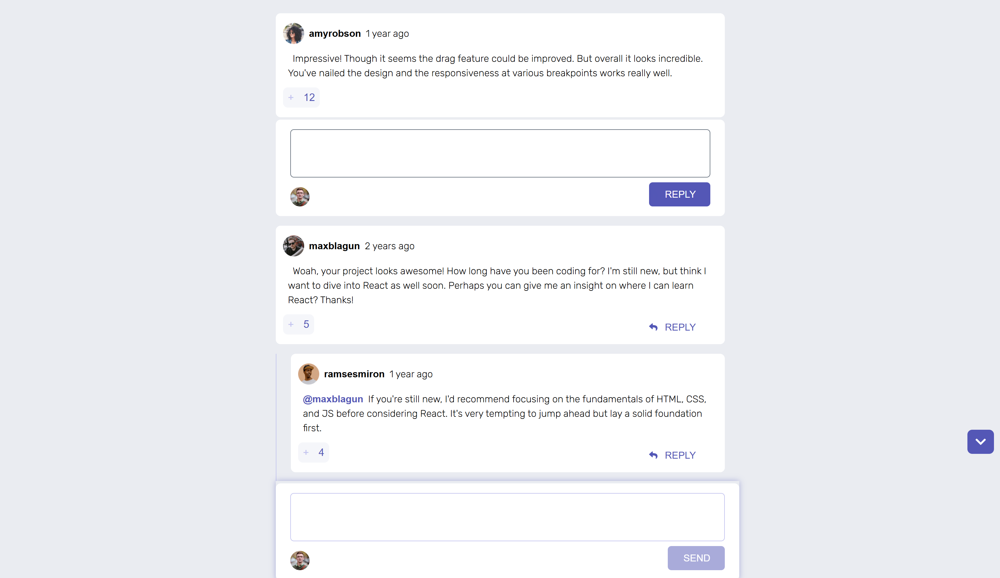
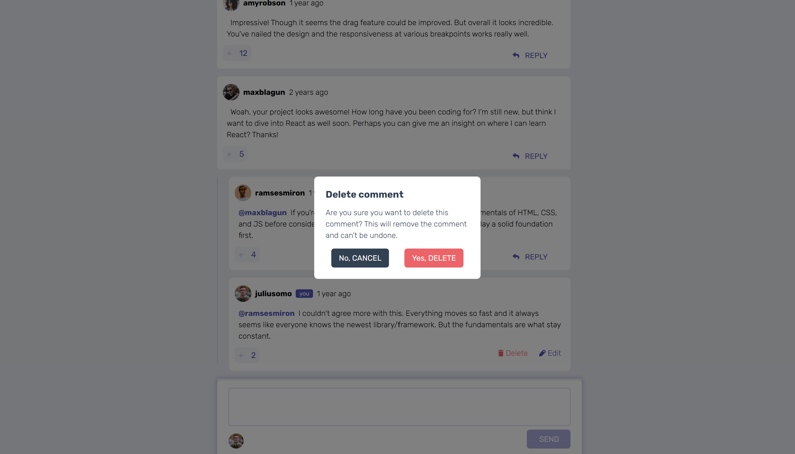

# Frontend Mentor - Interactive comments section solution

This is a solution to the [Interactive comments section challenge on Frontend Mentor](https://www.frontendmentor.io/challenges/interactive-comments-section-iG1RugEG9). Frontend Mentor challenges help you improve your coding skills by building realistic projects.

## Table of contents

- [Overview](#overview)
  - [The challenge](#the-challenge)
  - [Screenshot](#screenshot)
  - [Links](#links)
- [My process](#my-process)
  - [Built with](#built-with)
  - [What I learned](#what-i-learned)
  - [Continued development](#continued-development)
  - [Useful resources](#useful-resources)
- [Author](#author)
- [Acknowledgments](#acknowledgments)

## Overview

### The challenge

Users should be able to:

- View the optimal layout for the app depending on their device's screen size
- See hover states for all interactive elements on the page
- Create, Read, Update, and Delete comments and replies
- Upvote and downvote comments
- **Bonus**: If you're building a purely front-end project, use `localStorage` to save the current state in the browser that persists when the browser is refreshed.
- **Bonus**: Instead of using the `createdAt` strings from the `data.json` file, try using timestamps and dynamically track the time since the comment or reply was posted.

### Screenshot

Desktop

Reply Section

Comment Delete Modal

Mobile


### Links

- Solution URL: [https://github.com/abdulqad33r/interactive-comments-section-main]
- Live Site URL: [https://abdulqad33r.github.io/interactive-comments-section-main]

## My process

### Built with

- Semantic HTML5 markup
- CSS custom properties
- Flexbox
- CSS Grid
- Mobile-first workflow
- [SASS](https://sass-lang.com/)
- [TailwindCSS](https://tailwindcss.com/) - CSS Framework
- [React](https://reactjs.org/) - JS library
- [Redux](https://react-redux.js.org/) - JS library
- Typescript

### What I learned

While working on this project I learnt Redux and grid, and I got better at handling arrays and objects.

```tsx
// I'm calling the same SingleComponent inside the SingleComponent,
// Never did this kinda recursion in HTML before, It was fun to do this.
{
  comment.replies && comment.replies?.length !== 0 && (
    <div className="flex w-full">
      <div className="bg-light-grayish-blue phone:mx-[3%] phone:mr-[5%] my-4 mr-3 h-auto w-px" />

      <div className="w-full">
        {comment.replies?.map((reply) => (
          <SingleComment
            key={reply.id}
            id={reply.id}
            mainCommentId={mainCommentId}
            comment={reply}
            openReplySection={openReplySection}
            setOpenReplySection={setOpenReplySection}
            ToggleReplyOpen={ToggleReplyOpen}
          />
        ))}
      </div>
    </div>
  )
}
```

### Continued development

I will definitely work on my Redux skills, I think I could've code better in this project, and I will learn how to handle local storage in React apps.

## Author

- Website - [Abdul Qadeer](https://abdulqad33r.github.io/interactive-comments-section-main)
- Frontend Mentor - [@abdulqad33r](https://www.frontendmentor.io/profile/abdulqad33r)
